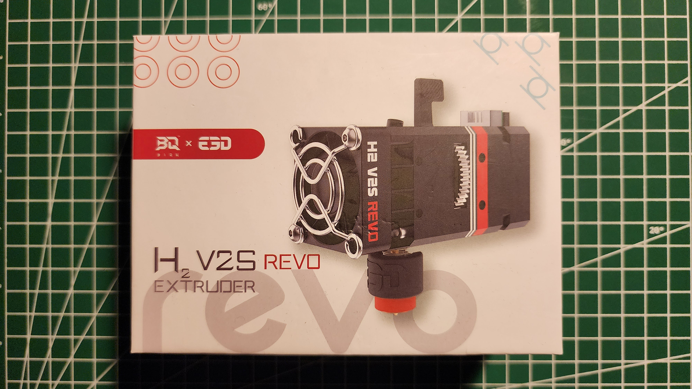
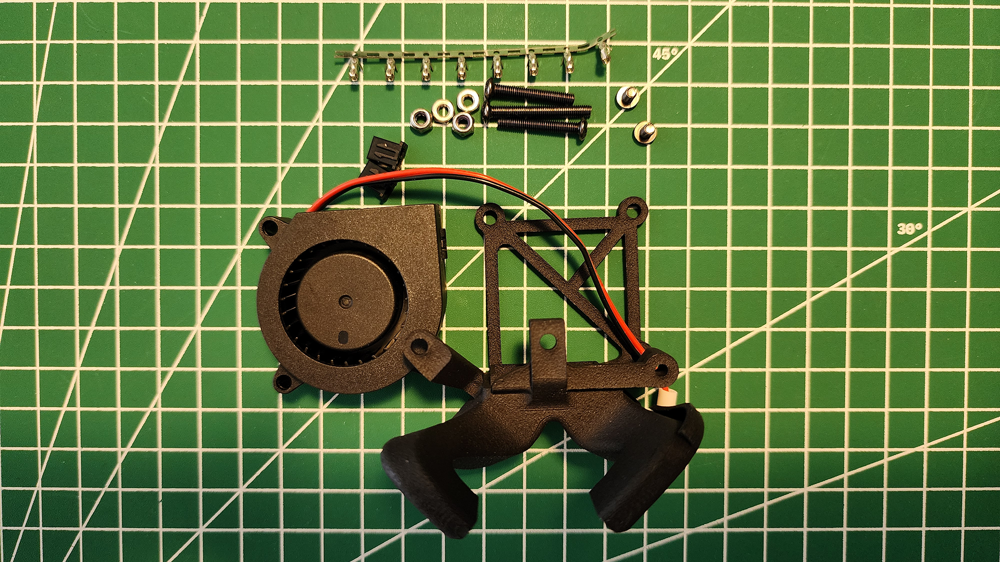

# H2 V2S Revo Extruder to Hermit Crab Tool Plate Installation
## H2 V2S Revo Extruder
Biqu’s H2 VS2 Revo Extruder is a direct-drive metal extruder kit with a dual-gear feeder. It is compatible with Ender series 3D printers.\

## Hermit Crab V2.0 CAN Bus Version
Hermit Crab V2.0 CAN Bus Version is a quick extruder-changing tool for different types of extruders, such as the H2 V2S Revo.

It has two parts:
- The fixed plate that you will connect to the Ender 3 Pro.\

- The tool plate on which you will install the H2 V2S Revo Extruder.\

## The Installation Process
### H2 V2S Revo Extruder Fan Assembly
When you take the H2 V2S Revo Extruder out of the box, you will notice that its fan needs to be assembled.\

Use two M3 screws to assemble the fan.\
Since I had M3x6 philips pan head screws, I preferred to use them. You can also use flat-head cap screws.\

### H2 V2S Revo Extruder Installation onto the Hermit Crab Tool Plate
The Hermit Crab V2.0 tool plate consists of top and bottom parts connected via three M3x5 flat (countersunk) head cap screws.

Disassemble the top and bottom parts.\
You will assemble the H2 V2S Revo Extruder to the bottom part of the tool plate.\

Assemble the H2 V2S Revo Extruder to the bottom part of the tool plate using two M3 screws.\
Since I had M3x4 philips pan head screws, I preferred to use them. You can also use flat-head cap screws.\

After connecting the H2 V2S Revo Extruder to the bottom part of the tool plate, assemble the top part using the three M3x5 flat (countersunk) head cap screws.\

### Wire Connections
H2 V2S Revo Extruder has three types of wires.
- Heater wires (the white-colored wires)
- Thermistor wires (the blue-colored wires)
- Fan wires (the black- and red-colored wires)

In addition to these wires, there are motor wires.\

You will connect each wire to the Hermit Crab V2.0’s top part.\

### Motor Wires
Connect the motor wires from the H2 V2S Revo Extruder to the Hermit Crab V2.0’s first socket (the one labeled as 2A, 1A, 1B, 2B).\

### Heater Wires
You need to modify the H2 V2S Revo Extruder’s heater wires (the white-colored wires) to connect to the Hermit Crab V2.0.\

Cut the wire ends to remove the connectors.\
You can cut, twist, and solder them or use a crimping tool to wire ferrules to the wire ends.\
I used [Someline’s Ferrule Crimping Toolkit](https://a.co/d/6WrWCFI "SOMELINE Ferrule Crimping Tool") for this process and 0.5mm^2 10mm wire ferrule.\

### Thermistor Wires
You need to modify the H2 V2S Revo Extruder’s thermistor wires (the blue-colored wires) to connect to the Hermit Crab V2.0.\

Cut the wire ends to remove the connectors.\
You can cut, twist, and solder them or use a crimping tool to wire ferrules to the wire ends.\
I used [Someline’s Ferrule Crimping Toolkit](https://a.co/d/6WrWCFI "SOMELINE Ferrule Crimping Tool") for this process and 0.25mm^2 8mm wire ferrule.\

### Fan Wires
You need to modify the H2 V2S Revo Extruder’s fan wires (the black- and red-colored wires) to connect to the Hermit Crab V2.0.\

Cut the wire ends to remove the connectors.\
You can cut, twist, and solder them or use a crimping tool to wire ferrules to the wire ends.\
I used [Someline’s Ferrule Crimping Toolkit](https://a.co/d/6WrWCFI "SOMELINE Ferrule Crimping Tool") for this process and 0.5mm^2 8mm wire ferrule.\

### Connections
Now, you can connect the H2 V2S Revo Extruder’s wires to the Hermit Crab V2.0.

The heater and thermistor wires have no polarity. You can connect them in any order.\
The fan wires have polarity, so you need to connect them in the correct order.\

## (Optional) Blowing Model Fan Kit Installation on H2 V2S Revo Extruder
If you have the Blowing Model Fan Kit for the H2 V2S Revo, you can follow the following steps to install it.\

Install the Nylon Sintered Fan Duct to the H2 V2S Revo using two M3 screws.\
Since I had M3 philips pan head screws, I preferred to use them. You can also use button head cap screws.\

Place the 4020 24V Turbo Fan into the fan duct.\
Install it using M3 button head cap screws and secure the parts using M3 anti-loose nuts.\

You must modify the Turbo Fan’s wires (the black- and red-colored wires) to connect to the Hermit Crab V2.0.\

You can cut, twist, and solder them or use a crimping tool to wire ferrules to the wire ends.\
I used [Someline’s Ferrule Crimping Toolkit](https://a.co/d/6WrWCFI "SOMELINE Ferrule Crimping Tool") for this process and 0.5mm^2 8mm wire ferrule.\

The fan wires have polarity, so you need to connect them in the correct order.\

Now, you can assemble the fixed plate of the Hermit Crab V2.0 to Ender 3 Pro in the next [part](https://github.com/CanBayraktarkatal/MantaE3EZ-HermitCrab2-CANBus-and-H2-V2S-Revo-Extruder-installation-on-Ender3Pro/blob/main/Hermit%20Crab%20V2.0%20to%20Ender%203%20Pro%20Assembly.md "Hermit Crab V2.0 to Ender 3 Pro Assembly").
